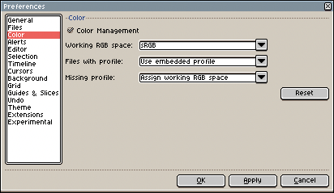

# Color Profile

We can see a pixel in the screen like a little rectangle with three
specific RGB values, each value can be seen as a number from 0.0 to
1.0 (or an integer from 0 to 255). It indicates a position in a 3D
space where each value is a position in each axis (Red, Green, and
Blue):

But what does it mean a position in this 3D cube? We know that
*RGB=(0, 0, 0)* represents the black color,
*RGB=(255, 0, 0)* represents red, *RGB=(255, 255, 255)*
it's white, etc. But what is [white](https://en.wikipedia.org/wiki/White_point) exactly?
What was the ambient light used when your display monitor was calibrated
and the manufacturer said *"OK, is this white"*?

Each device that must handle color (a monitor, a printer, a camera, a
scanner, etc.)  must be calibrated to convert the light in the ambient
to some specific RGB values in a picture, or viceversa, some RGB values
in this cube to [lightwaves](https://en.wikipedia.org/wiki/Light).

Color profiles indicate in which [color space](https://en.wikipedia.org/wiki/Color_space)
these RGB values are. What does it means to be pure red,
or pure blue, or pure green, or pure white.
It is used to match RGB values in one device (e.g. your monitor, where
you create your image) with other device (e.g. the user that will
watch your image in her/his monitor).

Images on Internet generally use the
[sRGB color space](https://en.wikipedia.org/wiki/SRGB),
but [PNG files](https://en.wikipedia.org/wiki/Portable_Network_Graphics) and
[JPEG files](https://en.wikipedia.org/wiki/JPEG) can embed
a specific [ICC color profile](https://en.wikipedia.org/wiki/ICC_profile)
with its [RGB gamut](https://en.wikipedia.org/wiki/Gamut)
and a [gamma correction](https://en.wikipedia.org/wiki/Gamma_correction).
Since Aseprite v1.2.10-beta2 can
save [color profiles in `.aseprite` files](https://github.com/aseprite/aseprite/blob/master/docs/ase-file-specs.md#color-profile-chunk-0x2007) too.

You can assign or convert the color profile of the current sprite
from [Sprite Properties](sprite-properties.md). And you can configure
how Aseprite manages color profiles from *Edit > Preferences > Color*:

---

**SEE ALSO**

[Color](color.md) |
[Sprite Properties](sprite-properties.md)
