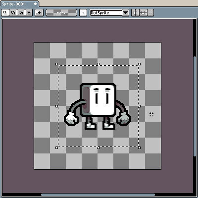
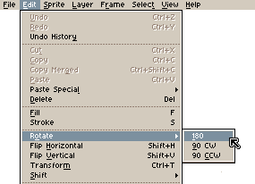
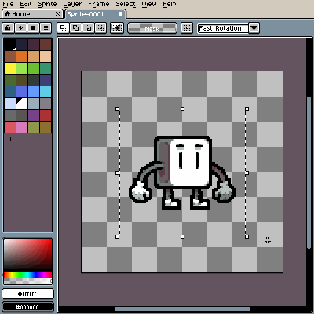
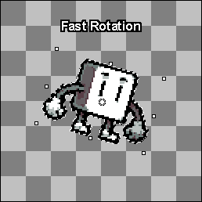

# Rotate Selection

Any selection can be rotated using either [handles](rotate.md#handles) or [menu options](rotate.md#menu-options), both methods will rotate the selection around the [pivot point](rotate.md#rotation-pivot) using the chosen [algorithm](rotate.md#rotation-algorithms).

## Rotation Pivot

The selection is rotated around a single, defined point (). By default the pivot point is set in the center of the selection and is not visible until you start rotating the image.

Its placement and visibility settings can be changed from the context bar of any selection tool. The rotation pivot can also be moved with the mouse by holding <kbd>Left click</kbd> and dragging the point:

Sprite by <a href="https://twitter.com/ThKasparrr">@ThKasparrr</a>

## Handles

The selection can be rotated by moving your mouse to the outer part of a handle (), holding <kbd>Left click</kbd> and dragging your mouse around the canvas:

The mouse cursor will adapt to indicate whether dragging a handle will resize or rotate the selection:

|        |                   Resize                   |                   Rotate                   |
| ------ | :----------------------------------------: | :----------------------------------------: |
| Cursor |  |  |

With <kbd>Shift</kbd> key you can snap angles (0º, 45º, 90º, etc.)

## Menu Options

The selection can be rotated by 90º or 180º using menu options under _Edit > Rotate_.

## Rotation Algorithms

There are two rotation algorithms available:

- Fast Rotation
- [RotSprite](https://en.wikipedia.org/wiki/Pixel-art_scaling_algorithms#RotSprite)

While RotSprite is widely accepted as an algorithm producing better results, the choice is up to your preferences.

---

**SEE ALSO**

[Flip](flip.md) |
[Resize](resize.md) |
[Move](move-selection.md)
